# Description du projet

Ce projet consiste à développer une application de gestion de comptes bancaires basée sur Spring Boot.
Chaque compte appartient à un client et peut subir plusieurs opérations de type **DEBIT** ou **CREDIT**.

Le système gère deux types de comptes :

- Compte courant
- Compte épargne

## Étape 1 : Création du projet Spring Boot
La première étape consiste à créer un projet Spring Boot avec les dépendances suivantes :

- Spring Web
- Spring Data JPA
- H2 Database
- MySQL Driver
- Lombok

Configuration de l'application
Le fichier application.properties permet de configurer la connexion à la base de données et les paramètres JPA/Hibernate :

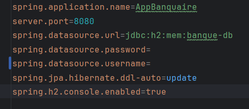


## Étape 2 : Création des entités JPA
Dans cette étape, nous avons modélisé les entités principales du système de gestion des comptes bancaires. Ces entités représentent les tables de la base de données ainsi que les relations entre elles.

###  Customer
Représente un client de la banque.  
Un client peut posséder plusieurs comptes bancaires.

---

###  BankAccount
Classe abstraite représentant un compte bancaire.  
Elle contient les informations générales communes à tous les types de comptes.

Nous avons choisi la stratégie d’héritage **Single Table** (une seule table pour toute la hiérarchie).  
Ainsi, tous les types de comptes (`CurrentAccount`, `SavingAccount`) sont stockés dans une seule table, avec une colonne discriminante permettant de distinguer leur type.

Chaque compte est associé à un seul client.

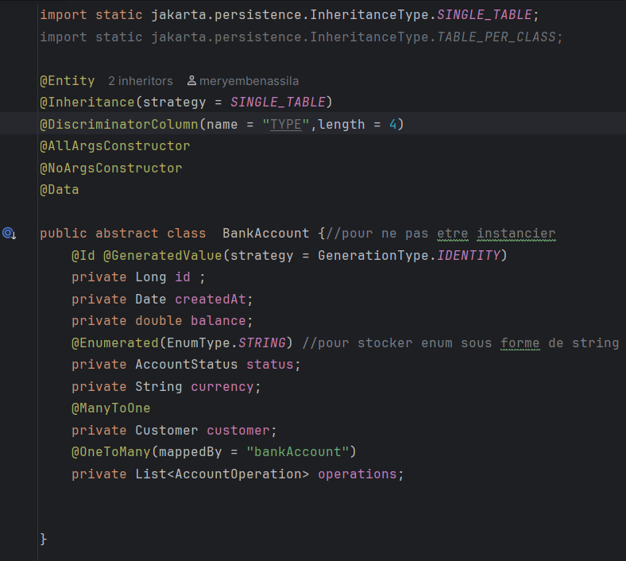
---

###  CurrentAccount
Représente un compte courant.  
Hérite de `BankAccount` et ajoute :
- découvert autorisé (overdraft)

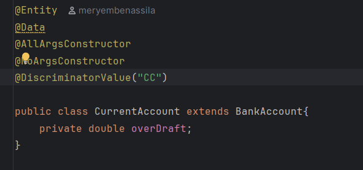
---

###  SavingAccount
Représente un compte épargne.  
Hérite de `BankAccount` et ajoute :
- taux d’intérêt (interest rate)

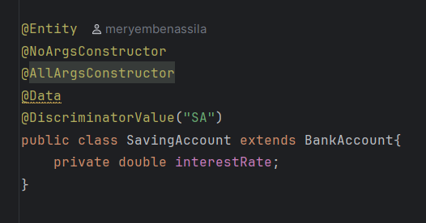

---

###  AccountOperation
Représente une opération effectuée sur un compte bancaire.  
Chaque opération est liée à un seul compte.

Elle contient :
- date de l’opération
- montant
- type (débit ou crédit)

---

###  OperationType
Énumération représentant le type d’opération :
- DEBIT
- CREDIT

---

### AccountStatus
Énumération représentant l’état du compte :
- CREATED
- ACTIVATED
- SUSPENDED

---

###  Relations entre les entités

- Un **Customer** possède plusieurs **BankAccount**
- Un **BankAccount** appartient à un seul **Customer**
- Un **BankAccount** peut avoir plusieurs **AccountOperation**
- Une **AccountOperation** est liée à un seul **BankAccount**
- Héritage entre **BankAccount**, **CurrentAccount** et **SavingAccount**

---

###  Diagramme 
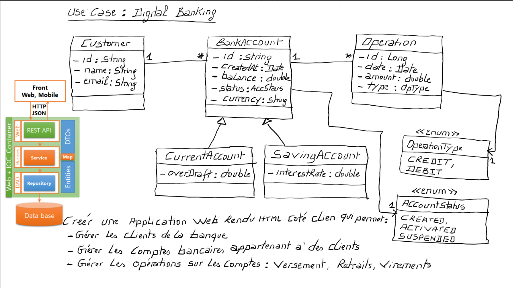

## Étape 3 : Création des interfaces Repository (DAO)
Dans cette étape, nous avons créé les interfaces Repository qui permettent d’interagir avec la base de données en utilisant **Spring Data JPA**.

Grâce à Spring Data, nous n’avons pas besoin d’implémenter les méthodes CRUD manuellement.

---

###  CustomerRepository
Permet de gérer les opérations liées aux clients.

---

###  BankAccountRepository
Permet de gérer les comptes bancaires (CurrentAccount et SavingAccount).

---

###  AccountOperationRepository
Permet de gérer les opérations bancaires (DEBIT / CREDIT).

## Étape 4 : Test de la couche DAO
Dans cette étape, nous avons testé la couche DAO pour vérifier le bon fonctionnement des entités et des repositories.

---

###  Objectifs des tests :
- Créer des clients
- Créer des comptes bancaires
- Ajouter des opérations
- Vérifier les relations entre entités

---

###  Méthode de test utilisée :
Nous avons utilisé un `CommandLineRunner` pour exécuter des tests automatiquement au démarrage de l’application.
 c
---
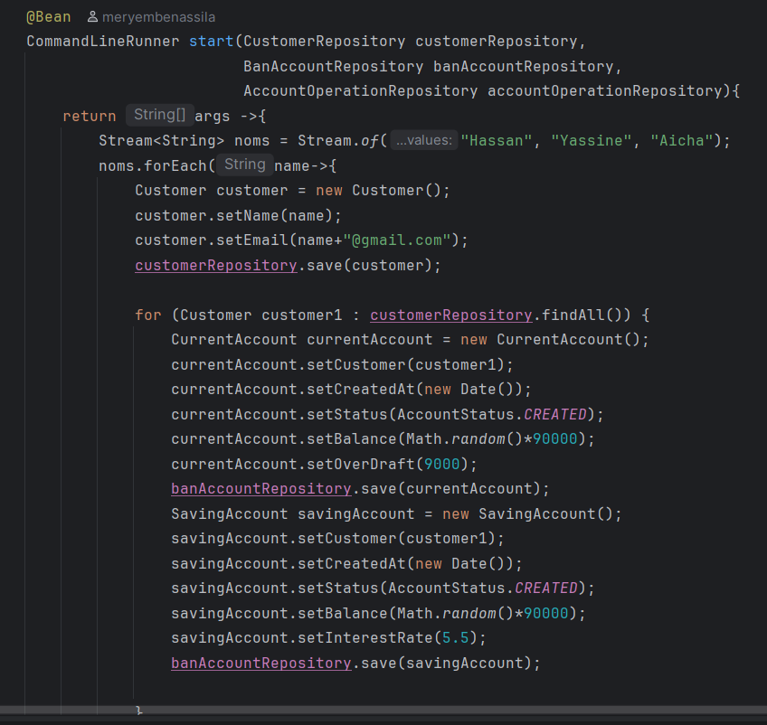

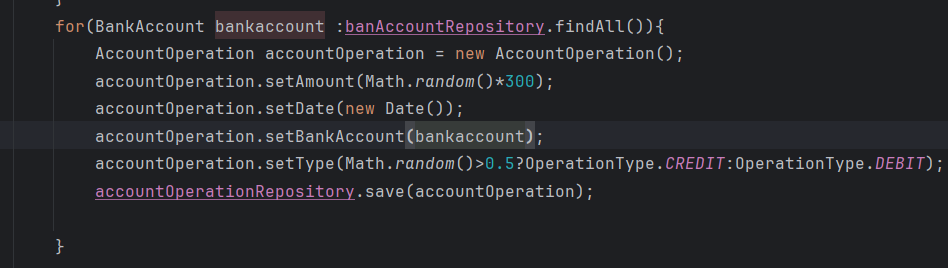

### Tests des 3 Stratégies d’héritage JPA 
#### 1. Stratégie Single Table

Dans cette approche, toutes les classes de la hiérarchie (`BankAccount`, `CurrentAccount`, `SavingAccount`) sont stockées dans **une seule table**.

 Une colonne discriminante permet de distinguer le type de compte.

 Voici comment la stratégie **Single Table** est représentée dans la base de données.

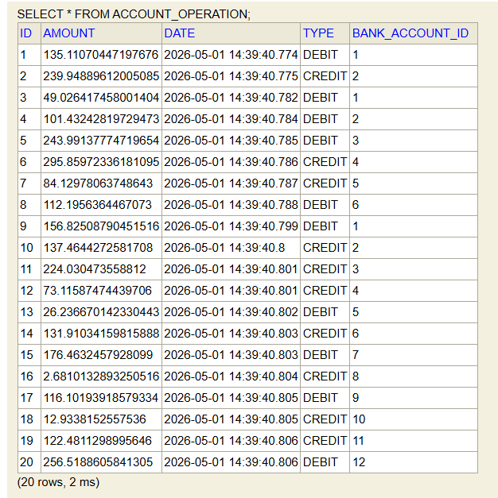

####  2. Stratégie Table Per Class (Model Per Table)

Dans cette approche, chaque classe concrète possède sa propre table.

- `BankAccount`
- `CurrentAccount`
- `SavingAccount`

Chaque table contient ses propres colonnes.

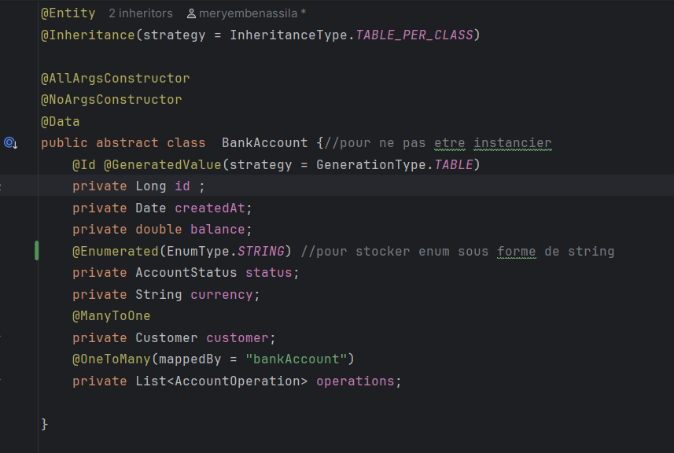

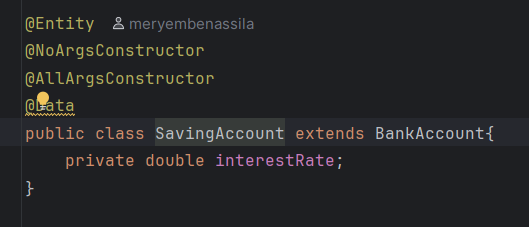

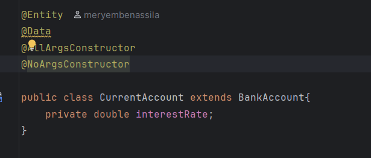

 Résultat :  
Voici comment la stratégie **Table Per Class** est représentée dans la base de données.

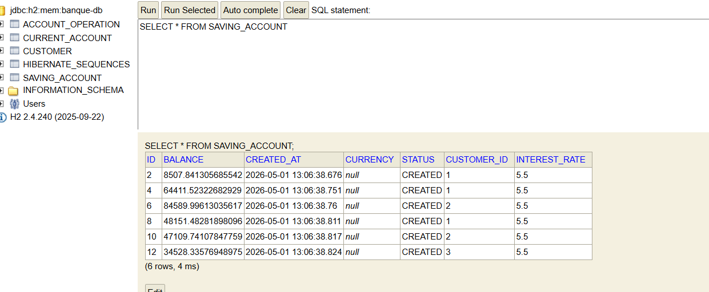

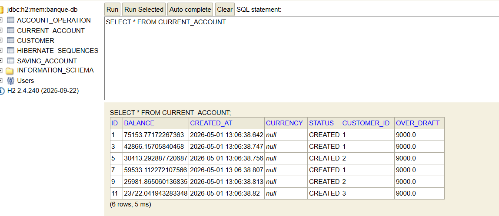
#### 3. Stratégie Joined

Dans cette approche, les données sont réparties sur plusieurs tables reliées par des clés étrangères.

- Une table pour `BankAccount`
- Une table pour `CurrentAccount`
- Une table pour `SavingAccount`

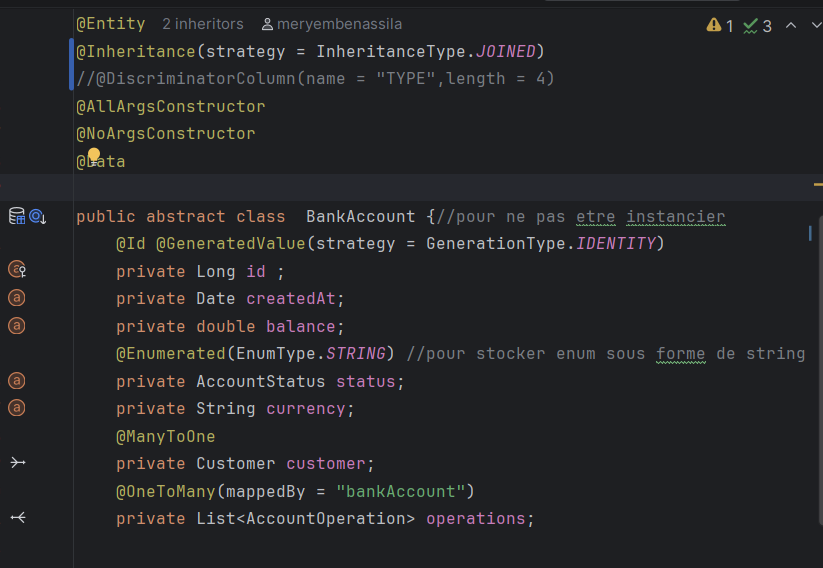


Voici comment la stratégie **Joined** est représentée dans la base de données.

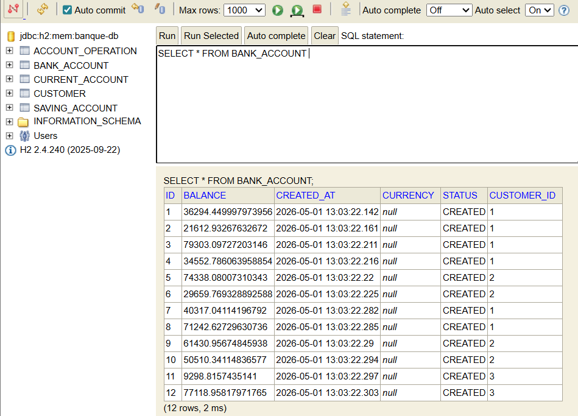

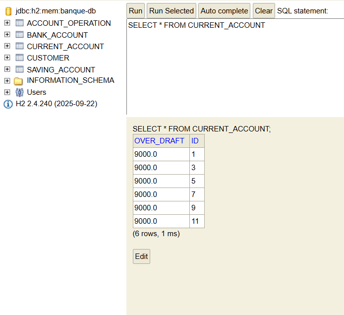

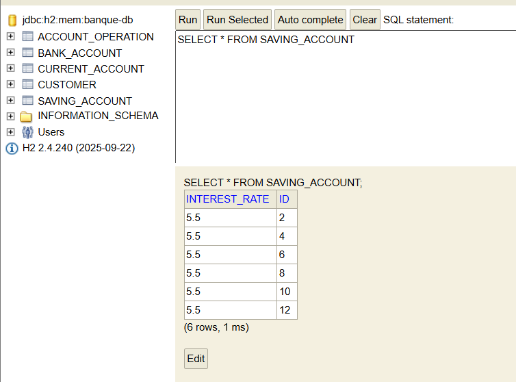

## Étape 5 : Développement de la couche Service

Dans cette étape, nous avons implémenté la couche Service qui contient la logique métier de l’application.

Cette couche fait le lien entre les **controllers (à venir)** et les **repositories (DAO)**.

---

##  Rôle de la couche Service

La couche Service permet de :
- Encapsuler la logique métier
- Manipuler les entités
- Gérer les règles métier (ex : vérification du solde)
- Centraliser les opérations bancaires

---

## ⚙ Interface BankAccountService

Nous avons défini une interface contenant les principales opérations métier :

###  Gestion des clients
- Ajouter un client
- Lister les clients

### Gestion des comptes
- Créer un compte courant
- Créer un compte épargne
- Consulter un compte
- Lister tous les comptes

###  Opérations bancaires
- Créditer un compte
- Débiter un compte
- Effectuer un transfert entre comptes

---
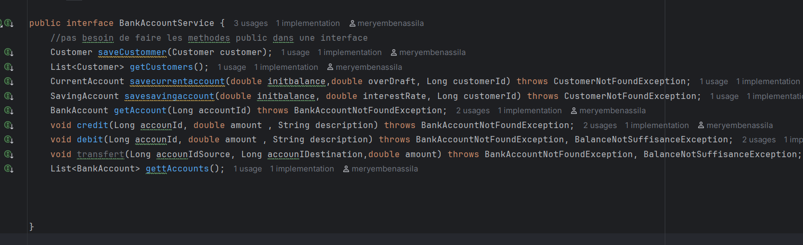

## 🏗 Implémentation : BankAccountServiceImpl

Nous avons créé une classe `BankAccountServiceImpl` annotée avec :
- `@Service` → composant Spring
- `@Transactional` → gestion des transactions
- `@AllArgsConstructor` → injection automatique des dépendances
- `@Slf4j` → gestion des logs

---

##  Logique métier implémentée

### Création de client
- Sauvegarde simple dans la base de données

---

###  Création de comptes

#### CurrentAccount
- Vérification de l’existence du client
- Ajout du overdraft
- Initialisation du solde et date de création

#### SavingAccount
- Vérification de l’existence du client
- Ajout du taux d’intérêt
- Initialisation du compte

---

###  Consultation de compte
- Recherche d’un compte par ID
- Exception si compte introuvable

---

###  Crédit d’un compte
- Création d’une opération de type CREDIT
- Ajout d’une description
- Enregistrement de l’opération

---

###  Débit d’un compte
- Vérification du solde disponible
- Exception si solde insuffisant
- Création d’une opération DEBIT

---

###  Transfert d’argent
- Débit du compte source
- Crédit du compte destination
- Réutilisation des méthodes existantes

---
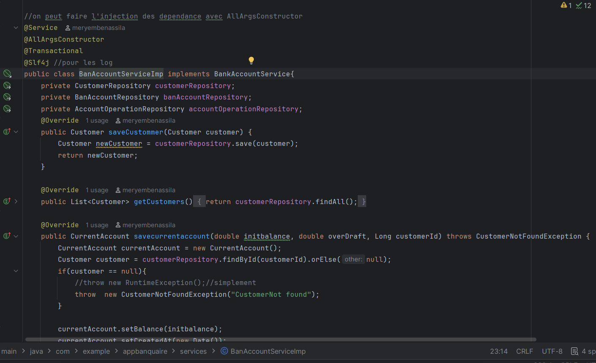
##  Gestion des exceptions

Nous avons implémenté des exceptions personnalisées :
- `CustomerNotFoundException`
- `BankAccountNotFoundException`
- `BalanceNotSuffisanceException`

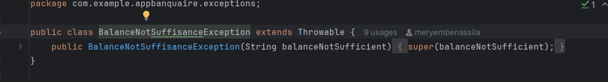

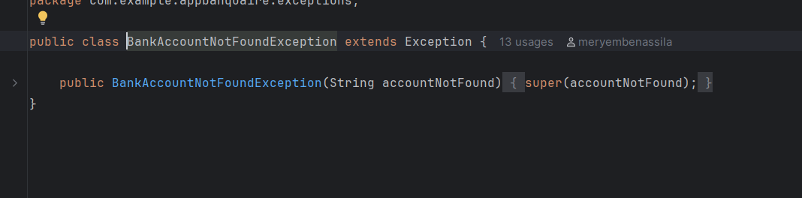

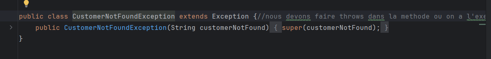
---


## Étape 6 : Création des DTOs et de la couche Web (Mapping)

Dans cette étape, nous avons introduit les **DTOs (Data Transfer Objects)** ainsi que la couche de mapping afin de séparer la logique métier de la représentation des données exposées via l’API REST.

---

##  Rôle des DTOs

Les DTOs permettent de :
- Sécuriser les données exposées au client
- Éviter d’exposer directement les entités JPA
- Structurer les réponses API
- Faciliter la communication entre backend et frontend

---

##  Les DTOs créés

###  CustomerDTO
Représente les informations d’un client exposées via l’API :
- id
- name
- email

---

###  BankAccountDto
DTO générique représentant un compte bancaire avec :
- type de compte (Current / Saving)

---

###  CurrentAccountDto
Représente un compte courant exposé à l’API :
- id
- balance
- createdAt
- status
- overDraft
- CustomerDTO

---

###  SavingAccountDto
Représente un compte épargne :
- id
- balance
- createdAt
- status
- interestRate
- CustomerDTO

---

###  AccountOperationDto
Représente une opération bancaire :
- id
- date
- amount
- description
- type (DEBIT / CREDIT)

---

###  AccountHistoryDto
Permet de retourner l’historique d’un compte :
- accountId
- balance
- liste des opérations
- pagination (currentPage, pageSize, totalPages)

---

## Couche de Mapping (BankAccountMapperImpl)

Nous avons créé une classe de mapping permettant la conversion entre :

- Entités ↔ DTOs

Cette classe utilise `BeanUtils.copyProperties()` pour simplifier le mapping.

---

### ⚙ Fonctionnalités du Mapper

####  Customer
- `Customer → CustomerDTO`
- `CustomerDTO → Customer`

---

#### Comptes bancaires
- `CurrentAccount → CurrentAccountDto`
- `CurrentAccountDto → CurrentAccount`
- `SavingAccount → SavingAccountDto`
- `SavingAccountDto → SavingAccount`

---

#### Opérations
- `AccountOperation → AccountOperationDto`
- `AccountOperationDto → AccountOperation`

---

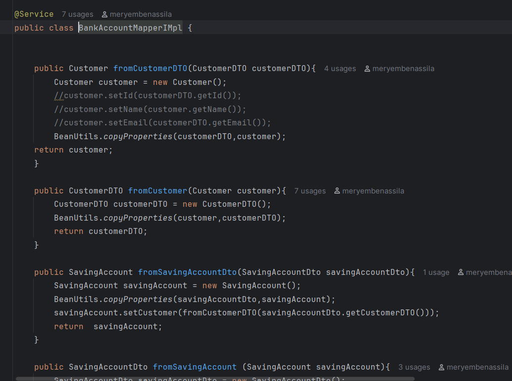


## Étape 7 : Création de la couche Web (RESTful API)

Dans cette étape, nous avons développé la couche Web de l’application en exposant des **API RESTful** à l’aide de Spring Boot.

Cette couche permet aux clients (frontend ou Postman) d’interagir avec le système bancaire.

---

##  Rôle de la couche Web

La couche Web est responsable de :
- Exposer les services via des endpoints REST
- Recevoir les requêtes HTTP (GET, POST, PUT, DELETE)
- Transmettre les données vers la couche Service
- Retourner des réponses JSON via les DTOs

---

##  CustomerController

Ce contrôleur gère toutes les opérations liées aux clients.

###  Endpoints disponibles :

- `GET /customers`  
  ➜ Récupérer la liste des clients

- `GET /customers/{id}`  
  ➜ Récupérer un client par ID

- `POST /customers`  
  ➜ Ajouter un nouveau client

- `PUT /customers/{id}`  
  ➜ Modifier un client existant

- `DELETE /customers/delete/{id}`  
  ➜ Supprimer un client

---

##  BankRestController

Ce contrôleur gère les comptes bancaires et les opérations.

---

### Gestion des comptes

- `GET /Accounts`  
  ➜ Liste de tous les comptes

- `GET /Accounts/{id}`  
  ➜ Détails d’un compte

- `POST /SavingAccounts`  
  ➜ Création d’un compte épargne

- `POST /CurrentAccounts`  
  ➜ Création d’un compte courant

---

###  Gestion des opérations bancaires

- `GET /Accounts/{accountId}/operations`  
  ➜ Liste des opérations d’un compte

- `GET /Accounts/{accountId}/pageOperations`  
  ➜ Historique paginé des opérations

---

###  Opérations 

- `POST /Account/{accountId}/debiter`  
  ➜ Débiter un compte

- `POST /Account/{accountId}/crediter`  
  ➜ Créditer un compte


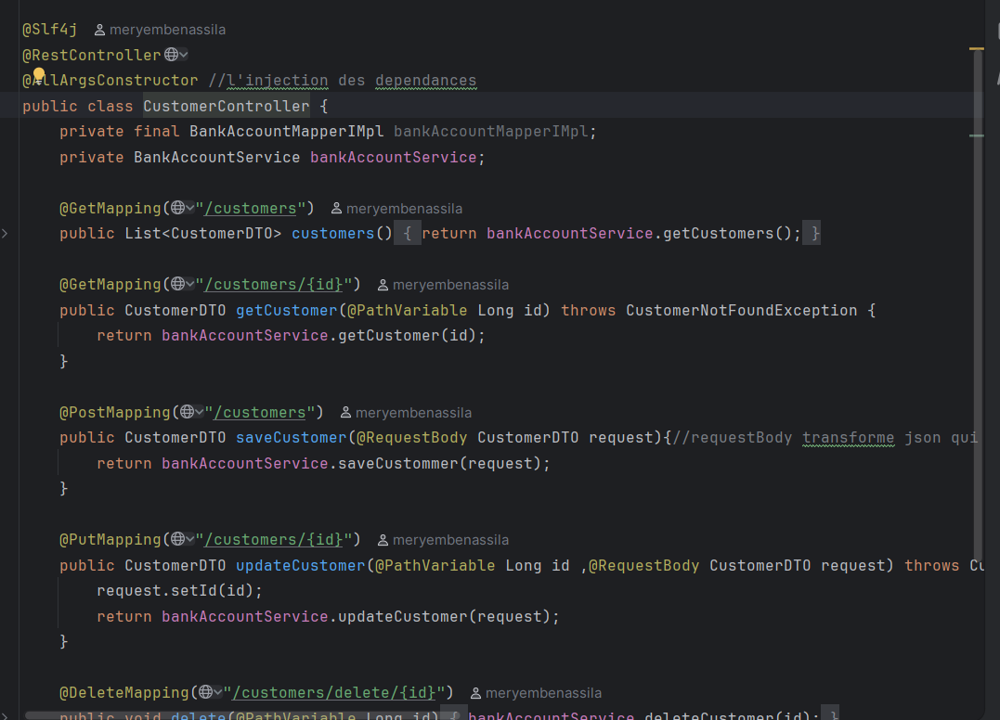


## Étape 8 : Test des web services RESTful

Dans cette étape, nous avons testé l’ensemble des API REST développées dans la couche Web afin de vérifier leur bon fonctionnement.

---

##  Outil de test utilisé : Swagger

Nous avons utilisé **Swagger UI** pour tester et documenter automatiquement les web services RESTful.

Swagger permet de :
- Visualiser tous les endpoints de l’API
- Tester directement les requêtes HTTP (GET, POST, PUT, DELETE)
- Consulter les schémas des DTOs
- Vérifier les réponses JSON en temps réel

---

##  Développement de la partie Frontend (Angular)

Dans le cadre de ce projet, nous avons également développé une interface utilisateur en utilisant **Angular** afin de consommer les API REST créées dans le backend.

le frontend est present dans le repo git suivant 

Le frontend est disponible dans le dépôt GitHub suivant :  
 https://github.com/meryembenassila/BankingDigitalFrontend.git
---

##  Objectif du frontend

Le frontend permet de :
- Interagir facilement avec le système bancaire
- Afficher les données des clients
- Ajouter de nouveaux clients
- Consommer les services REST de Spring Boot

---

##  Pages développées

###  Page Customers
Cette page permet de :
- Afficher la liste des clients
- Consulter les informations de chaque client
- Supprimer un client

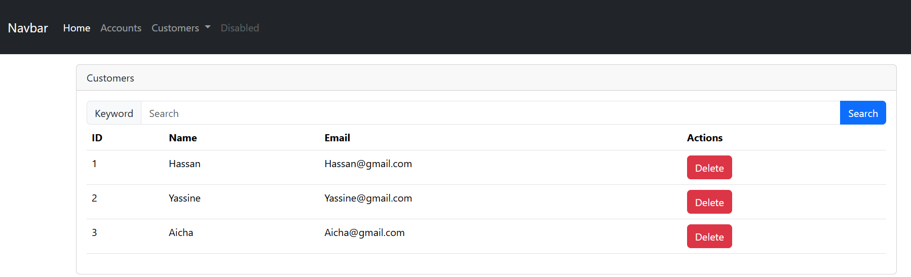

---

###  Page Add Customer
Cette page permet de :
- Ajouter un nouveau client
- Envoyer les données du formulaire vers le backend

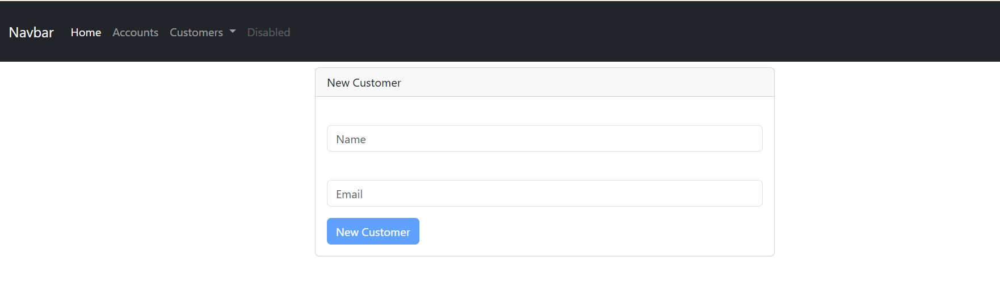
---


## Étape 9 : Sécurité de l’application (Spring Security + JWT)


Dans ce projet, nous avons mis en place un système de sécurité basé sur **Spring Security** avec une architecture **stateless** utilisant des **tokens JWT (JSON Web Token)**.

### ⚙Configuration de la sécurité

La sécurité est configurée à l’aide de `SecurityFilterChain`, qui permet de définir les règles d’accès aux différentes routes de l’application.

* Activation du mode **stateless** (`SessionCreationPolicy.STATELESS`) : aucune session n’est stockée côté serveur.
* Désactivation de la protection **CSRF** (adapté pour les API REST).
* Protection de toutes les routes via :

  ```java
  .anyRequest().authenticated()
  ```
* Certaines routes sont accessibles sans authentification (comme `/auth/login`).

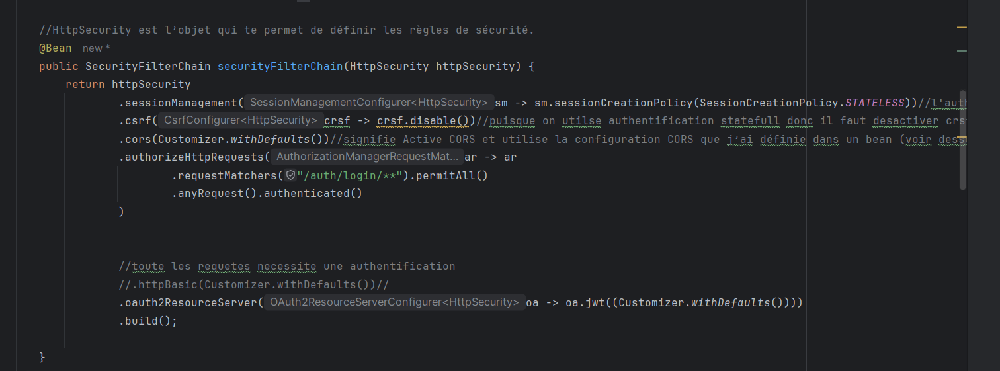

---

###  Authentification avec JWT

L’authentification repose sur l’utilisation de **JSON Web Tokens (JWT)** :

1. L’utilisateur envoie ses identifiants via l’endpoint `/auth/login`.
2. Le backend vérifie les informations.
3. Si elles sont valides, un **token JWT** est généré et retourné.
4. Ce token contient :

  * le username (`sub`)
  * les rôles/permissions (`authorities` ou `scope`)
  * la date d’expiration

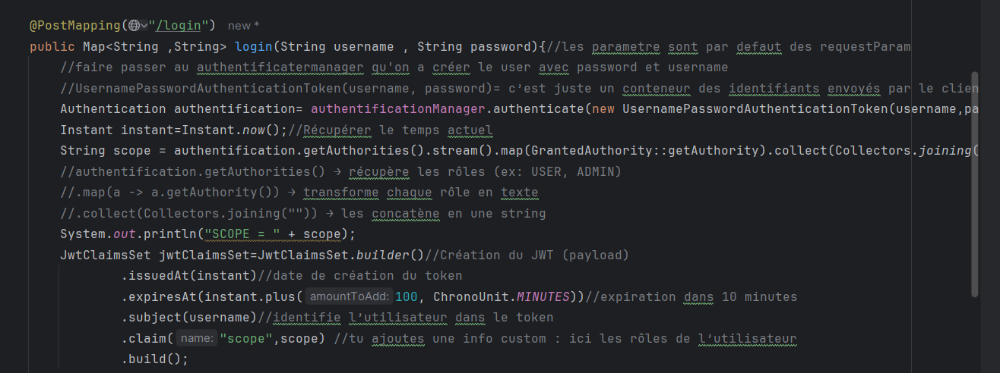

---

###  Protection des endpoints

Les routes sensibles sont protégées avec des annotations comme :

```java
@PreAuthorize("hasAuthority('SCOPE_ADMIN')")
```

Cela signifie que seul un utilisateur ayant le rôle **ADMIN** peut accéder à ces endpoints (ex : suppression d’un client).

---

